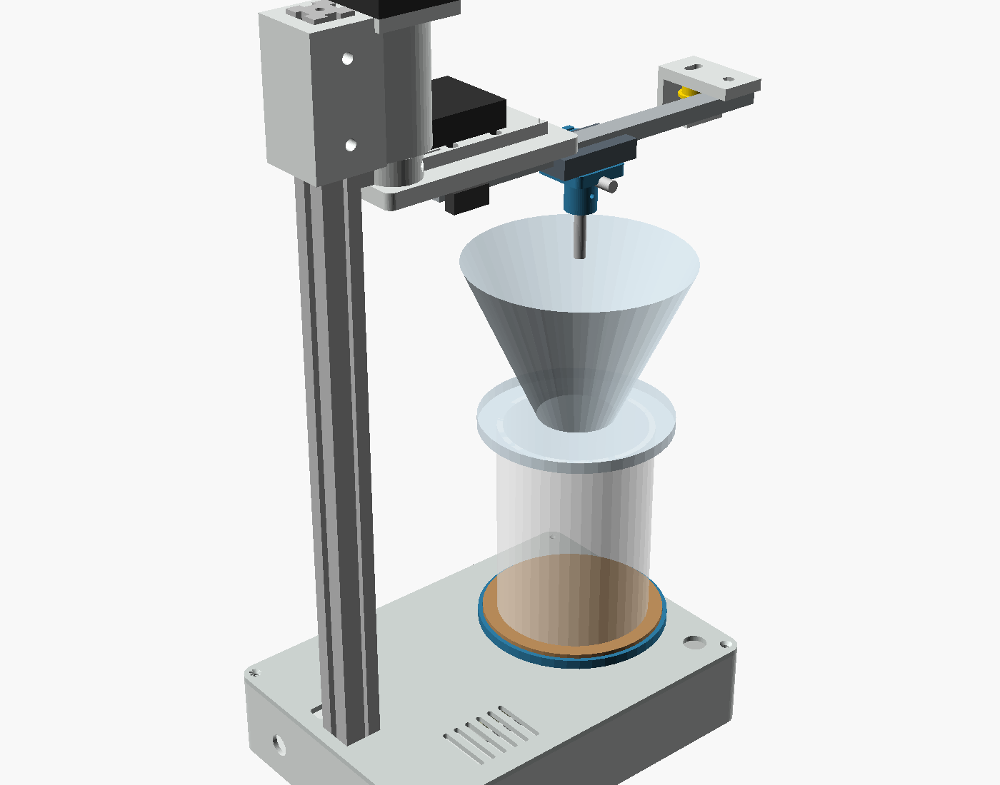

# OpenPour

An open-source automatic pour-over machine. It has a 3D-printed body and
commodity parts from the 3D-printer aisle. It's controlled from any phone or
laptop browser, with no app store and no cloud.



- **Pours like a barista.** A two-axis polar arm traces centre, circle and
  spiral patterns over the dripper.
- **Pours by volume.** An inline flow meter counts every millilitre, and
  1 mL of water is 1 g, so each stage stops at its gram target whatever the
  pump does.
- **Configurable recipes.** Stages, water, flow rate, pattern, radius, speed
  and bloom/wait times are all editable in the app and stored on the machine.
- **Low voltage only.** You fill an insulated reservoir from your own
  kettle. The machine pumps, meters and measures temperature, but never
  heats water.
- **Parametric.** Set your cup and dripper heights in one OpenSCAD file and
  the column length, head position and parts follow.

## Why

Automatic pour-over machines exist, but the commercial ones are expensive and
closed: proprietary parts, companion apps or cloud accounts, and little room to
repair or change them. OpenPour goes the other way. It's built from parts you
can buy anywhere and a body you print yourself, it's controlled from any
browser, and everything is open: the CAD, the firmware and the app.

It's also a learning project, built in the open: a way to work through
embedded Rust, motion control, flow measurement and mechanical design on
something real, and to leave a record that others can learn from, build and
improve.

## How it works

```
 reservoir ──tube──► peristaltic pump ──► flow meter ──► nozzle on carriage
 (hot water,                                  │            │  radial axis (belt, pancake NEMA17)
  DS18B20)                                    │   arm ─────┘  theta axis (direct-drive NEMA17)
                                              │    │
                                              │  dripper and cup on the base
                                              │
                ESP32 ◄────── pulses ─────────┘ ──Wi-Fi──► browser app (served by the ESP32)
```

The firmware converts each pattern from dripper-centred coordinates into arm
angle and carriage radius 100 times a second. Both steppers run in velocity
mode so the nozzle can follow spirals smoothly. The pump's speed is
feed-forward from its calibrated rate, trimmed by the measured flow, and cut
just early enough that the pump's coast-down lands on target.

## Repository

| Path | What |
|---|---|
| `hardware/cad/` | OpenSCAD model. `config.scad` holds every dimension; `make` exports STLs |
| `firmware/` | ESP32 firmware in Rust: `pourcore/` holds the hardware-independent logic, `esp32/` runs it on ESP-IDF, `sim/` runs it on a PC against simulated hardware |
| `web/` | The control app: TypeScript (`src/`) bundled with esbuild into `dist/`, which the firmware embeds at build time |
| `docs/` | [BOM](docs/BOM.md), [wiring](docs/wiring.md), [assembly](docs/assembly.md), [calibration](docs/calibration.md) |

## Build it

1. **Print.** In `hardware/cad`, edit `config.scad`, then run `make`, or
   open `openpour.scad` in OpenSCAD and choose a part. Print in PETG or ASA.
2. **Buy.** See the [bill of materials](docs/BOM.md). It comes to about
   US$170–210 (CA$240–300, €150–190).
3. **Wire.** See [wiring](docs/wiring.md).
4. **Flash.** Install [Node.js](https://nodejs.org) 18 or newer (the
   firmware build compiles the web app), and the Rust ESP32 toolchain once:
   ```sh
   cargo install espup ldproxy espflash
   espup install --targets esp32     # writes ~/export-esp.sh
   ```
   espflash 4.6 needs Rust 1.95 or newer; on an older Rust, install
   `espflash@4.5.0` instead.
   Then plug in the board and run:
   ```sh
   source ~/export-esp.sh
   cd firmware/esp32
   cargo run --release    # builds the web app and firmware, flashes, opens the monitor
   ```
   The first build downloads ESP-IDF, so it takes a while. The serial
   monitor shows the address to open. On Linux, add yourself to the group
   that owns `/dev/ttyUSB0` (`uucp` on Arch, `dialout` on Debian/Ubuntu).
5. **Calibrate.** Follow [calibration](docs/calibration.md). On first boot,
   join the `OpenPour-XXXX` Wi-Fi network (password `pourover`) and open
   http://192.168.4.1.

## Develop without hardware

### Host simulator (the real firmware logic)

`firmware/sim` runs the firmware's logic (`pourcore`: brewing, flow control,
motion, the flow meter, command handling) on your computer against simulated
hardware: stepper axes with endstop switches, a pump with ripple and
coast-down, and a flow meter whose real pulses-per-litre differs from the
default, so calibration matters as it does on a real machine. It serves the
built web app and the firmware's exact API.

```sh
cd web && npm ci && npm run watch      # rebuilds web/dist on save (or `npm run build` once)
cd firmware/sim && cargo run           # then open http://localhost:8080
```

- **Options:** `--speed 4` runs four times faster, `--lan` lets a phone on your
  network connect, and `--port`, `--data` and `--web` change the defaults.
  Settings and recipes persist in `firmware/sim/data/`.
- **Logging:** the firmware's log lines print in the terminal. Run with
  `RUST_LOG=debug` to also see the flow controller's internals.
- **`GET /api/sim`** shows what really happened, for example how much water
  reached the cup (`dispensedG`). Use it as the "real amount" when you
  calibrate the meter.
- **`POST /api/sim`** injects faults and drives the hardware, for example:

  ```sh
  curl -X POST localhost:8080/api/sim -d '{"faults":{"dry":true}}'
  ```

  - Faults: `dry`, `meterDead`, `radialEndstopStuck`, `thetaEndstopStuck`,
    `noProbe`.
  - Hardware: `trueGps` (pump rate), `truePpl` (meter pulses per litre),
    `tempC`, `{"press": "short"|"long"}` (the front button), and
    `{"resetDispensed": true}`.

### Wokwi (the real firmware on a simulated ESP32)

[Wokwi](https://wokwi.com) emulates the ESP32 itself, so it runs the actual
firmware image: ESP-IDF, Wi-Fi, the HTTP server and the drivers. Use it for
the code the host simulator can't reach. `firmware/wokwi/diagram.json` wires
up the board as `docs/wiring.md` describes, with two custom chips written in
Rust (`firmware/wokwi/chips`):

- **Pump + flow meter:** it reads the pump's PWM duty on GPIO 23 and sends
  pulses to GPIO 16 at a realistic rate.
- **Stepper axis + endstop** (one per axis): it counts STEP/DIR pulses and
  closes the endstop switch at the end of travel, so homing really runs.

Each chip has sliders for faults: dry pump, dead meter and a broken switch.
The DS18B20, the button and a pump LED are standard Wokwi parts.

```sh
firmware/wokwi/run.sh --timeout 60000     # builds if needed (--build to force), then runs wokwi-cli
```

`run.sh` takes the token from `WOKWI_CLI_TOKEN` or from `~/.wokwi/token` (a
bare token or a `NAME=token` line). It explains a missing or rejected token,
and passes any other options to `wokwi-cli`. `build.sh` builds the chips, the
firmware with `--features wokwi`, and a 4 MB flash image.

The `wokwi` feature makes the firmware join Wokwi's open `Wokwi-GUEST`
network instead of starting its own access point. In VS Code with the Wokwi
extension, open `firmware/wokwi/` and the web app is at
http://localhost:8180. The token is free from wokwi.com/dashboard/ci.

### Browser-only mock

```sh
cd web
npm ci
npm run dev
# open http://localhost:8000/?mock          (add &speed=4 to fast-forward)
```

`src/mock.ts` is a simplified machine written in TypeScript. It needs no Rust
toolchain, and edits to `src/` show up on reload. Because it's a separate
implementation, check behaviour against the host simulator. The protocol's
types live in `src/types.ts`. Before committing, run `npm run typecheck`
(`npm run build` also runs it). Neither simulator is part of the firmware
build.

## Firmware tests

Kinematics, pour patterns, flow control, flow-meter counting, motion control,
the brew state machine and command handling all live in `pourcore`, which
has no hardware dependencies. Its tests run on your computer, with a
simulated machine for the brew tests. The simulator's own tests brew through
the real homing sequence and flow meter, including fault cases:

```sh
cd firmware/pourcore && cargo test
cd firmware/sim && cargo test
```

## Recipe format

Recipes are stored on the machine as JSON. `water` is the amount added
in that stage, in grams.

```json
{
  "id": "v60-single",
  "name": "V60 single cup",
  "dose": 15,
  "minTemp": 92,
  "stages": [
    { "name": "Bloom", "water": 45, "flow": 4, "pattern": "spiral", "radius": 22, "rps": 1.2, "wait": 40 },
    { "name": "Pour 1", "water": 55, "flow": 4.5, "pattern": "spiral", "radius": 26, "rps": 1, "wait": 10 }
  ]
}
```

`pattern` is `center`, `circle` or `spiral`. `rps` is revolutions per
second around the dripper.

## API

| | |
|---|---|
| `GET /api/settings`, `POST /api/settings` | Machine settings (partial updates allowed) |
| `GET /api/recipes`, `POST /api/recipes` | The full recipe array |
| `ws://<host>/ws` | Status pushed 5× per second; send `{"cmd": "start", "recipe": "<id>"}`, `pause`, `resume`, `stop`, `home`, `park`, `center`, `jog`, `setCenter`, `release`, `prime`, `meterRun` (calibration dispense), `calMeter` (`{"ml": <measured>}`), `calPump` |

## Status

The firmware (Rust, on ESP-IDF) compiles and its core logic is unit-tested,
including simulated brews, but it hasn't run on real hardware yet. The app
runs against the simulator. The mechanical design is a first revision that hasn't
been printed yet. Expect to adjust clearances, switch positions and hole
sizes on the first build. Reports and fixes are welcome.

## Safety

Hot water burns. Keep the reservoir lid on and the machine on a stable
surface, and never run the pump without a cup under the nozzle. The firmware
stops if the flow meter sees no water, or if it counts more than the recipe
holds. It can't see what is in the cup, though, so it is not a substitute
for paying attention.

## License

MIT. See [LICENSE](LICENSE).
